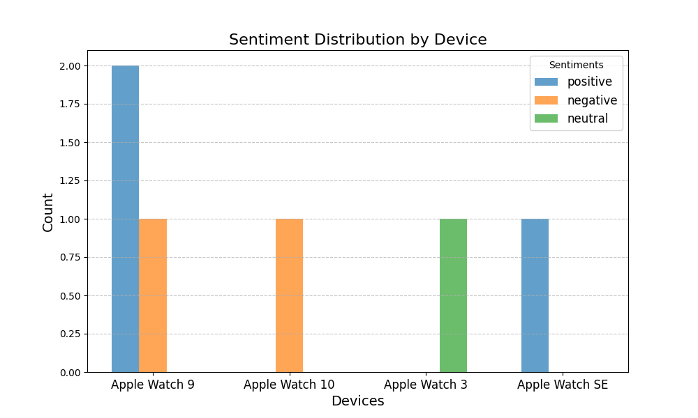

CS 325 Project 3: A combination of Project 1 and Project 2 that uses the review files from BestBuy that I scraped in Project 2 and calls PHI-3 that I did in Project 1.
I will start off by giving steps on how to use this program.
1. First you will need to install ```pip install huggingface_hub```, ```pip install matplotlib```, and ``` pip install pytest```. These will allow you to call PHI-3 through hugging face using API and also graph the sentiments of PHI-3 response. This also uses pytest to test the functions and class. Another install you will need is ```pip install numpy```. This helps the bar graph define the x positions of the bars.
2. Once these are all installed in the environment then we can look at the program.
3. Once the program is up make sure you have activated the environment in the terminal ```conda activate cs325``` then you are good to run the program.


Now to describe how to the program works.
First we ```import os``` this helps look at the files in the operating system that we need to use or make. Next ```huggingface_hub import InferenceClient``` this uses hugging face to call the API to activate PHI-3. Next ```from collections import Counter``` this helps count the sentiments when we put them in the array form. Next ```importmatplotlib.pyplot as plt``` this is what I used to graph the sentiments in my ```def plot_sentiment_distrubution``` function. Finally ```import numpy as np``` this is talked about above how it puts the bars in the bar graph in certain positions.

Now onto the class ```class HuggingFaceChat:``` this is the class I used to call hugging face, read the prompts, generate a response, save the response, and look through the multiple review files.

The functions inside the class. 
1. The first function is ```def __init__(self, model_name, token=None):``` this function uses the token in main and the model_name in main to get the token and name to get from hugging face.
2. The second function is ```def read_prompts(self, file_path):```. This function reads in the prompts that I got from Project 2 when I scraped BestBuy for Apple Watch reviews.
3. The third function is ```def generate_responses(self, prompts, max_tokens=100)```. This function generates the response from the phi-3 model and save them to a response array. I included instructions for the phi-3 model like this ```instruction = ( "Analyze the following text and respond with 'positive', 'negative', or 'neutral' sentiment only:\n\n")```,  and that's how I got it to only respond with positive, negative, or neutral.
4. My fourth function is ```def save_response(self, prompts, responses, output_path):```. This is what saves the generated responses to the output path by using responses array and writing the response to the output_path that is specified in main.
5. My fifth and last function in the class is ```def process_multiple_files(self, input_files, output_files, max_tokens=100):```. This is what takes my 4 review files from Project 2. It takes the 4 review files and makes sure that there is also the same number of output files as the review files.

Outside of the class I made a function to make the bar graph.```def plot_sentiment_distribution(device_sentiments, output_path=None):```. This function takes the matplotlib that we imported in the beginning to make a bar graph of the given sentiments that is counted in main. Then it is saved as a png and is going to be put in this README.md file.

Now the last part is main. ```if __name__ == "__main__":```. This is where the token is stored as a variable,  ```token = "xxxxx" ```. The chat_bot is called, ```chat_bot = HuggingFaceChat("microsoft/Phi-3-mini-4k-instruct, token=token)```. The input and output files are both specified. Once those files are specified then you can run ```chat_bot.process_multiple_files(input_files, output_files, max_tokens=100)```. This runs all the files specified and puts the responses into the output files specified. Then we call device_sentiments for the graph. ```device_sentiments = { "Apple Watch 9": ["positive", "positive", "positive", "neutral", "positive"], "Apple Watch 10": ["positive", "neutral", "positive", "neutral", "positive"], "Apple Watch 3": ["positive", "positive", "negative", "positive", "positive"], "Apple Watch SE": ["neutral", "positive", "positive", "positive", "negative"]}```
This is not the full list of sentiments but just an example.

Finally we call the graph function, ```plot_sentiment_distribution(device_sentiments, output_path="test_graph.png")```. This just saves the graph to make sure it looks right before moving it to the README.md file.


